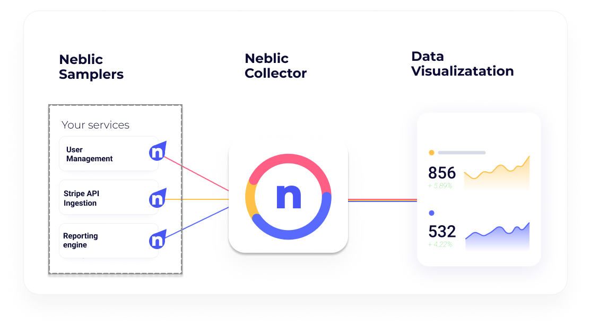

# Neblic Platform

## What is Neblic

<!--what-is-neblic-start-->
The purpose of the Neblic platform is to help engineering teams troubleshoot their applications by capturing, analyzing and displaying the exact data contained in the events, transactions, requests and responses that the application is processing.

This new way of troubleshooting is intended to work alongside the famous 3 pillars of observability: Metrics, logs and traces by extending that observability to the actual outputs of an application as it’s just working in real-time.

### What’s our story?

Neblic is born out of our experience managing complex software applications that combine data streaming pipelines, 3rd party APIs and microservices at global scale.

In developing for and supporting these applications, we often found that while existing Application Performance Monitoring services were critical in helping us maintain the services, they often weren’t enough to really answer What happened, where and why it happened.

While answering these questions will in most cases require a person with domain knowledge to provide the final touch, Neblic’s vision is to provide the insights and the collaboration space for individuals and teams working on solving some of the most difficult questions in software development and software management.

How we are solving these challenges is by creating an infrastructure to sample application-data from any application in real-time, providing the tooling to manage the data sampling infrastructure, and providing tools to filter through and see this data.
<!--what-is-neblic-end-->

## How does Neblic Work

<!--how-does-neblic-work-start-->
The Neblic platform enables you to observe your application data and get actionable insights by using three main components:

* Samplers, which are deployed across points of interest in your application where you want to get application data that is then sent to the collector.
* Collector which receives data samples from all the Samplers and processes them before sending them to the Visualization engine.
* Visualization engine is where all the samples are processed, and data is available for visualization and analysis.

Samplers -as their name implies- sample data from the application in the points you’ve deployed them. By application data we mean the exact data contained in the events, transactions, requests and responses that the application is processing at each point.

All those samples are sent to the collector which is the central point from which samples will then be forwarded to the visualization engine. However, the collector also has another key role, it’s the central point for coordinating the configuration of all the samplers.

Lastly, after data is sampled and sent through the collector, you’ll want to store and visualize the data. As of this time, we recommend you use Loki and Grafana, however you can use other tools if you’re more comfortable with them.

We are actively working on dedicated analysis and visualization tools for this kind of data, do reach out to us if you have some thoughts on what you’d like to achieve.
<!--how-does-neblic-work-end-->

## Learn more

* Quickly spin up an instrumented e-commerce application and play with Neblic using our [playground](https://github.com/neblic/playground). See this [page](https://neblic.github.io/platform/latest/quickstart/sandbox/) for a step-by-step guide.
* Check Neblic [documentation](https://neblic.github.io/platform) to learn more about how it works and how to use it.

## Contributing

See the [contributing](./CONTRIBUTING.md) guide.