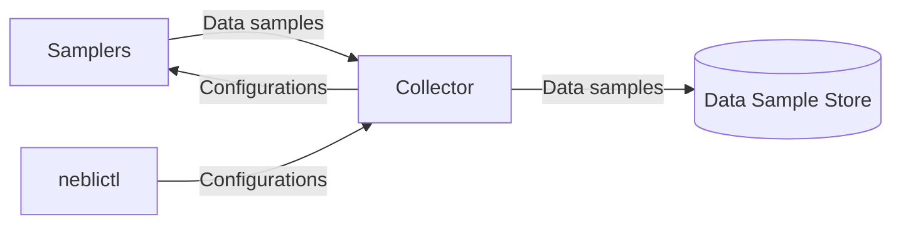

# Concepts

This page provides an overview of the main concepts and components that make up the Neblic platform. If you are new to Neblic or need a refresher, this page will provide you with the information you need to effectively learn how to use Neblic. 

The following diagram shows most of the concepts presented here and serves as a visual aid to understand how they all interact. Keeping this diagram handy while reading the following sections will help you follow each one of the concepts.

## Sampler

A component or library that generates `Data Samples`. It can be thought of as a logger that specializes in logging semi-structured data (e.g. JSON) but smarter. `Samplers` connect to Neblic's `Control Plane` and `Data Plane`, so they can be dynamically configured at runtime, and their function is to export `Data Samples` to an external system for further analysis. 

For more information about the types of `Samplers` that are available and best practices for their use, you can read the [samplers](../learn/samplers.md) section.

### Data sample

Any piece of information in a semi-structured format that may be of interest to understand how the system works. Software systems, regardless of their architecture (i.e. microservices, event-driven, stream processing), continuously generate and process data in response to internal and external events: requests, responses, updating internal state, executing queries... all of this generated data can be captured as a `Data sample` to gain depth insights into how the system works.

Each `Sampler` supports different serialization formats and message types. These are described on the [samplers](../learn/samplers.md#available-samplers) page 

### Sampling Rule

An expression that determines whether a `Data Sample` should be exported. Usually based on the contents of the `Data Sample`, but this is not necessarily the only condition that can take part n determining whether a `Data Sample` should be captured. `Sampling Rules` are provided by clients and sent to `Samplers` using Neblic's `Control Plane` (described in the next section).

You can take a look at this [section](../learn/samplers.md#configuration) to learn more about how to set up `Sampling Rules` and this [reference](../reference/sampling-rules.md) page to see their syntax.

## Control Plane

Neblic implements a protocol that allows you to configure at runtime, how `Samplers` behave. For example, you can update the `Sampling Rules` that a `Sampler` evaluates to decide which `Data Samples` should export, or you can set a new maximum sampling rate to limit the amount of `Data Samples` that a `Sampler` can export per second.

The `Control Plane` has a central server to which all `Samplers` and clients connect. It stores the configurations sent by the clients and acts as a broker, passing them on to the `Samplers` when they register. Although it can run independently, it is common to run the `Control Plane` server in the Neblic collector along with the `Data Samples` collection endpoint.

If you want to learn how to interact with the control plane so you can configure `Samplers`, check [this](../reference/neblictl.md) guide that shows how to use the `neblictl` CLI to send commands. 

## Data plane

`Data Samples` are exported from `Samplers` encoded as [OpenTelemetry (OTLP) logs](https://opentelemetry.io/docs/reference/specification/logs/data-model), and are exported to other systems using the [OTLP/gRPC](https://opentelemetry.io/docs/reference/specification/protocol/otlp/#otlpgrpc) transport protocol. 

Using a standard encoding and protocol defined by the OpenTelemetry project allows the Neblic `Data Plane` to interoperate with any system capable of processing and storing OTLP-compliant log telemetry. In practice, this means that you may be able to store `Data Samples` in your existing log store.

## Collector

The `Collector` is the central point that receives `Data Samples` from `Samplers` installed throughout your whole system. It could be considered an optional component if your final data collection point is capable of receiving `Data Samples` directly (which, for the time being, means that it is capable of receiving OTLP logs following the OTLP/gRPC protocol). However, the recommended approach is to make use of a `Collector` to quickly offload `Data Samples` and let it do any additional work required to get the `Data Sample` to its final destination.

As mentioned above, it is common (and it is the recommended approach) to run Neblic's `Control Plane` server in the `Collector` to simplify the deployment.

Neblic uses the [OpenTelemetry Collector](https://opentelemetry.io/docs/collector/) because of its flexibility and maturity. For more details on how to configure the OTEL collector for use with Neblic, please refer to the deployment [guide](../getting-started/deployment.md).

## Store

Once `Data Samples` are exported from `Samplers` and received by the `Collector`, they are stored for later exploration. When using the OpenTelemetry-based `Collector`, and because `Data Samples` are encoded as OpenTelemetry logs, you have many possible data store choices.

The deployment [guide](../getting-started/deployment.md) will help you choose which store to use. You can read more information about what stores are recommended [here](../learn/stores.md).