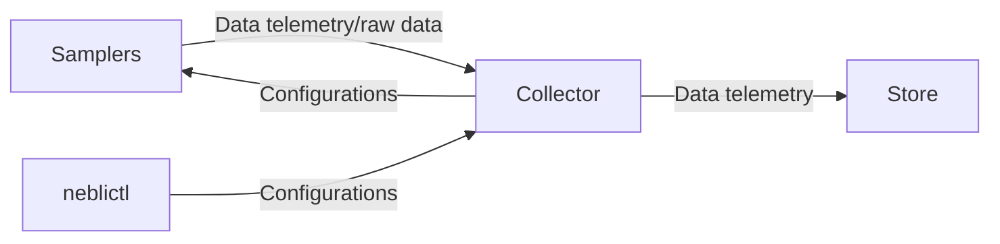

# Concepts

This page offers a detailed look at the key ideas and elements that form the foundation of the Neblic platform. Whether you're getting acquainted with Neblic for the first time or just looking for a recap, this guide is designed to help you understand how to utilize Neblic efficiently.

The following diagram shows most of the concepts presented here and serves as a visual aid to understand how they all interact. Keeping this diagram handy while reading the following sections will help you follow each one of the concepts.

## Sampler

A component or library that processes *Data Samples*. It can be thought of as a logger that specializes in logging semi-structured data (e.g. JSON) but smarter. *Samplers* connect to Neblic's *Control Plane* and *Data Plane*, so they can be dynamically configured at runtime, and their function is to generate *Data Telemetry* and forward it to the *Collector*. It may also forward *Data Samples* to the collector for further analysis.

For more information about the types of *Samplers* that are available, how they work, and best use practices, you can read the [samplers](../learn/samplers.md) section.

### Data sample

Any piece of information in a semi-structured format that may be of interest to understand how the system works. 

Software systems, regardless of their architecture (i.e. microservices, event-driven, stream processing), continuously generate and process data in response to internal and external events: requests, responses, updating internal state, executing queries... all of this generated data can be captured as a *Data sample* to get insights into how the system is working.

Each *Sampler* supports different serialization formats and message types. These are described on the [samplers](../learn/samplers.md#available-samplers) page 

### Stream

A subset of *Data Samples* filtered using a sampling rule evaluated against the contents of the *Data Sample*, although this is not necessarily the only condition that can take part on determining whether a *Data Sample* should be added as part of the stream.

You can take a look at this [section](../learn/samplers.md#configuration) to learn more about how to create *Streams* and this [reference](../reference/rules.md) page to see their syntax.

#### Keyed stream

A *Stream* can be be futher divided using a key provided together with the *Data Sample*. This key is used to logically divide the stream into disjoint partitions where all *Samples* with the same key are assigned to the same partition. It is then possible to extract *Data Telemetry* form each partition independently.

### Data Telemetry

Neblic defines as *Data Telemetry* its three main principles: *Data Value Statistics*, *Data Structure*, and *Businesss Logic and Data Validation*. While these are [higher level concepts](/) as the ones defined in this section, the following concepts are the foundation that supports those principles.

#### Digest

A summary of a collection of *Data Samples*. These can be generated at different points of the platform depending of your preferences and requirements. There are two types of digests: structure digests and value digests.

* A *Structure Digest* encodes information about the *Data Samples* schemas i.e. the fields and their types. For example, it registers how many times a field is present over the total of *Data Samples* processed.

* A *Value Digest* aggregates the values seen in each field. This allows, for example, to show value metrics and statistics about the contents of your *Data Samples*.

*Digests* provide the foundation for *Data Value Statistics* and *Data Structure*.

#### Event

Something that has happened that is potentially interesting to understand the behavior of the application. The main way of generating events is by defining rules that are evaluated on the *Data Samples* contents.

You can take a look at this [section](../learn/samplers.md#configuration) to learn more about how to create *Events* and this [reference](../reference/rules.md) page to see their syntax.

*Events* provide the foundation for *Business Logic and Data Validation*.

## Control Plane

Neblic implements a protocol that allows you to dynamically configure at runtime, how *Samplers* behave. For example, you can create new *Streams* to decide which *Data Samples* should be processed, or you can set a new maximum sampling rate to limit the amount of *Data Samples* that a *Stream* can export or process per second.

The *Control Plane* has a central server to which all *Samplers* and clients connect. It stores the configurations sent by the clients and acts as a broker, passing them on to the *Samplers* when they register. Although it can run independently, it is common to run the *Control Plane* server in the Neblic collector along with the *Data Samples* collection endpoint.

If you want to learn how to interact with the control plane so you can configure *Samplers*, check [this](../reference/neblictl.md) guide that shows how to use the *neblictl* CLI to send commands. 

## Data plane

The *Data Plane* is implemented on top of the `OpenTelemetry (OTel)` protocol. All messages are encoded as [OpenTelemetry (OTLP) logs](https://opentelemetry.io/docs/reference/specification/logs/data-model), and are exported to other systems using the [OTLP/gRPC](https://opentelemetry.io/docs/reference/specification/protocol/otlp/#otlpgrpc) transport protocol. 

Using a standard encoding and protocol defined by the OpenTelemetry project allows the Neblic *Data Plane* to interoperate with any system capable of processing and storing OTLP-compliant log telemetry. In practice, this means that you are able to store *Data Samples* and *Data Telemetry* in your existing log store if you are already using an OTel compatible stack.

## Collector

The *Collector* is the central point that receives *Data Telemetry* and *Data Samples* from *Samplers* installed throughout your whole system. As mentioned above, it is common (and it is the recommended approach) to run Neblic's *Control Plane* server in the *Collector* to simplify the deployment.

Neblic uses the [OpenTelemetry Collector](https://opentelemetry.io/docs/collector/) because of its flexibility and maturity. For more details on how to deploy and configure the *Collector*, please refer to the usage [guide](../getting-started/usage.md).
