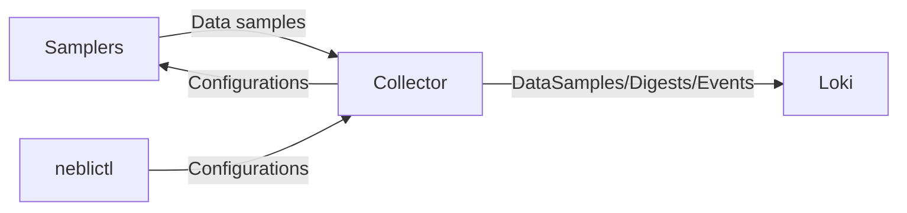

# Usage

Before starting this tutorial make sure you have a general idea of the components that make up the Neblic platform. If not, please read the [concepts](../getting-started/concepts.md) page first.

There are two components that you need to set up to start using Neblic: a `Collector` and some `Samplers`. The following diagram outlines how these components interact with each other.



## Collector

We provide binaries and container images. The container images run the `Collector` and contain the `neblictl` configuration CLI for easier configuration.

* Binaries can be found on the [GitHub releases](https://github.com/neblic/platform/releases) page.
* Containers are available on the [GitHub packages](https://github.com/neblic/platform/pkgs/container/otelcol) page.

This guide will now walk you through deploying a container-based `Collector`.

### Container

The container is configured by default to expose a `Control Plane` server at port `8899` and a data collection point at port `4317`.

To create an API key you need to have an account at [https://app.neblic.com/](https://app.neblic.com/). You can then create the API key going to the `API tokens` section. Once created, write it down so you can provide it to the container.

#### Supported architectures

For now, only `x86-64` builds are offered. If you need another architecture you can build your own container following [this](../how-to/build-your-own-collector.md) guide.

You can find all the `Collector` container releases in [this](https://github.com/neblic/platform/pkgs/container/otelcol) page. The latest release is always tagged as `ghcr.io/neblic/otelcol:latest`.

#### Examples

##### docker-compose

``` yaml
--8<-- "./dist/otelcol/compose/docker-compose.yaml"
```

##### kubernetes

Create a secret with your exporter API token

```yaml
apiVersion: v1
kind: Secret
metadata:
  name: neblic-otelcol
stringData:
  exporter-bearer-token: <your-api-token>
```

and then a StatefulSet and a Service definition to deploy the `Collector`.

``` yaml
--8<-- "./dist/otelcol/k8s/statefulset.yaml"
```

#### Learn more

To get more details into how the collector works and how to configure it take a look at [this](../learn/collector.md) page.

## Samplers

See [this](../learn/samplers.md#available-sampler) page to see a list of the available samplers and instruction on how to use them.
