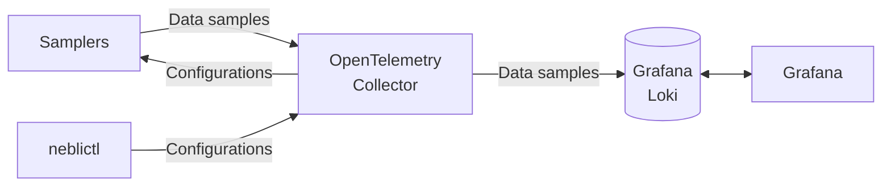

# On-prem data visualization

Neblic provides all the components needed to export `Data Samples` from your applications and components. These components include `Samplers`, the `Control Plane` server and clients, and others. However, since `Data Samples` are encoded as [OpenTelemetry (OTLP) logs](https://opentelemetry.io/docs/reference/specification/logs/data-model), and use the [OTLP/gRPC](https://opentelemetry.io/docs/reference/specification/protocol/otlp/#otlpgrpc) protocol for transport, any logging stack compatible with OpenTelemetry log telemetry can be used as a backend for Neblic. Therefore, there are two ways to proceed:

  1. Use the recommended stack. These components are based on open-source software, have been tested, and provide a good user experience.
  2. Reuse your logging pipeline to ingest and store `Data Samples`. If you already have a stack that is compatible with OpenTelemetry log signals, or that can be configured to ingest them, this is the fastest way to get started, although not necessarily the best one. Your experience with Neblic will largely depend on the capabilities of your log exploration tool and your log store. 

Before deciding to reuse your current logging stack you need to consider:

  * Can your log ingestion pipeline receive OpenTelemetry logs using the OTLP/gRPC protocol?
  * Is your log exploration interface able to filter nested documents using complex expressions? `Data Samples` are encoded as JSON documents within the log body, and to explore them, you will want to be able to create filters based on their contents. 
    * For example, if your data is in this format: `{id: "1", product_name: "T-Shirt", price: -10 }`, you would ideally want to be able to create an expression to filter all of these `Data Samples` similar to `sample.price < 0`.

If you want to give it a try with your current logging pipeline, you can skip to this [section](./#reuse-your-existing-logging-stack) where you can find out which Neblic-specific components you will need to deploy. Otherwise, please read on.

##  Deploying an open-source Neblic backend

The recommended stack uses of a custom-built [OpenTelemetry Collector](https://opentelemetry.io/docs/collector/) with the Neblic `Control Plane` server bundled as an extension. `Samplers` connect to the collector to send `Data Samples` and to receive configurations (i.e. `Sampling Rules`). The `Data Samples` are then forwarded to [Grafana Loki](https://grafana.com/oss/loki/), where they are stored. Finally, [Grafana](https://grafana.com/grafana/) is used to explore them.

### Grafana and Loki

Grafana and Loki do not require any special configuration to be store `Data Samples`, so you can follow Loki's [official guides](https://grafana.com/docs/loki/latest/installation/) to get it working in your infrastructure. `Data Samples` are sent directly from the collector to Loki, so `Promtail` is not required. Then, you will need to install Grafana. You can follow Grafana's [official guide](https://grafana.com/docs/grafana/latest/#installing-grafana) to install it.

Finally, you need to add Loki as a data source in Grafana. You can follow [this guide](https://grafana.com/docs/grafana/latest/datasources/loki/) to configure it. You won't see any data for now until you send some `Data Samples` but if you have been able to add Loki as a Grafana source without seeing any errors, you are ready to go!

!!! Note
    Once you have completed the deployment and have some `Data Samples` stored in `Loki`, you can learn how to use Grafana to explore them on [this](../learn/stores.md#grafana-loki) page.

### OpenTelemetry Collector

Visit the [collector](../learn/collector.md) page to learn how to run and configure it. `Samplers` need to connect to the collector `Control` and `Data` plane addresses, by default at ports `8899` and `4317` respectively. Write down these addresses, as you will need them when configuring a `Sampler`.

After the deployment, you are ready to configure your first `Sampler`. You can read about the existing `Samplers` [here](../learn/samplers.md).

## Reuse your existing logging stack

### Data Plane

It would be impractical to maintain an up-to-date list and instructions for every logging stack that can be used as a Neblic backend. Vendors and open-source projects are constantly adding support for OpenTelemtry so it is quite likely that you will find that it is possible to send `Data Samples` to your existing logging platform without major changes.

To do this, you will need to look at your current logging stack documentation and find out how to send long using the OTLP/gRPC protocol. Write down this address, as it will be Neblic's `Data Plane` endpoint address and you will need it when configuring your `Samplers`.

Now, you need to deploy Neblic's `Control Plane` server.

### Control Plane

The recommended approach is to embed Neblic's `Control Plane` server into your OpenTelemetry Collector. If you already have an OpenTelmetry Collector running in your infrastructure, you may want to build a custom OpenTelemetry Collector distribution that includes Neblic's `Control Plane` server as an extension plus any other components you are currently using. See the [Build your own collector](../how-to/build-your-own-collector.md) to guide to learn how to do this. 

If you are not using an OpenTelemetry collector in your `Data Plane`, or you just want to deploy Neblic alongside your current telemetry pipeline, you can use the collector provided by Neblic that includes the `Control Plane` server. See the [collector](../learn/collector.md) page to learn how to run and configure it.

Once deployed, you are ready to configure your first `Sampler`. You can learn about the existing `Samplers` in [here](../learn/samplers.md).
