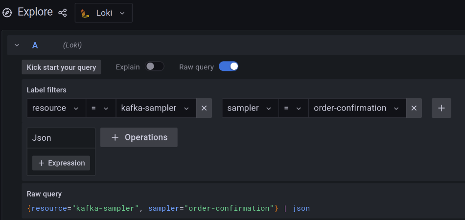

# Store and visualize data with Loki

[Grafana Loki](https://grafana.com/oss/loki/), quoting their website, *is a log aggregation system designed to store and query logs from all your applications and infrastructure*. *Data Samples* are similar to logs so `Loki's` architecture and design fit well with Neblic goals.

It is the primary open-source option for storing *Data Samples* due to its ease of deployment and maintenance. In also integrates perfectly with [Grafana](https://grafana.com/grafana/), making it easy and efficient to explore data samples.

## Store

### Use Neblic collector (recommended)

The Neblic collector already provides all the required changes to be able to send data to *Loki*. The only missing thing is to provide the collector with the *Loki* endpoint. That can be done populating the `NEBLIC_DATA_PLANE_EXPORTER_LOKI_ENDPOINT` environment variable with the desired value.

### Using your own OpenTelemetry collector (advanced)

!!! warning
    This approach assumes the knowledge on how to build and configure an OpenTelemetry collector.

When using your own OpenTelemetry collector, the following things have to be configured to export data to Loki:

Add the [Loki exporter](https://github.com/open-telemetry/opentelemetry-collector-contrib/tree/main/exporter/lokiexporter) to the [collector builder file](https://github.com/open-telemetry/opentelemetry-collector/tree/main/cmd/builder) if necessary. Build the custom collector.
``` yaml
processors:
  ...
--8<-- "./dist/otelcol/ocb.yaml:TransformProcessor"
  ...
exporters:
  ...
--8<-- "./dist/otelcol/ocb.yaml:LokiExporter"
  ...
```

After doing that, an OpenTelemetry collector with the *Loki* exporter logic will be available. The only remaining thing to do is to modify the [collector configuration](https://opentelemetry.io/docs/collector/configuration/#basics) to enable the exporter.

Configure Loki exporter to send data to the desired endpoint:
``` yaml
exporters:
  # ...
--8<-- "./controlplane/server/otelcolext/reference.yaml:LokiExporter"
  # ...
```

Elevate *Sampler* resource to a *Loki* label. After doing that, *Loki* will automatically index the *Data Samples* by resource, resulting in query speedup. More details about Loki labels can be found [here](https://grafana.com/docs/loki/latest/fundamentals/labels/).
``` yaml
processors:
  # ...
--8<-- "./controlplane/server/otelcolext/reference.yaml:LokiProcessor"
  # ...
```

Configure a new pipeline that receives data from the *Neblic* connector, uses the `populate_loki_labels* processor and sends the data to *Loki`.
``` yaml
service:
  pipelines:
    # ...
--8<-- "./controlplane/server/otelcolext/reference.yaml:LokiPipeline"
    # ...
```

Run the custom collector with the new configuration

## Visualize

To explore *Data Samples* stored in *Grafana Loki*, *Grafana* is the best option. 

First, you need to add *Grafana Loki* as a *Data Source*, the official documentation provides a [guide](https://grafana.com/docs/grafana/latest/datasources/loki/).

Then, you can use the *Explore* tab to perform queries and explore your *Data Samples*. You will need to:

* Select *Loki* on the top-level dropdown to explore its contents.
* Apply a *label filter* selecting one or more labels to filter what the *Data Samples* you want to explore.
* Optionally, add a *json* filter so it parses the contents of the *Data Samples*.

Example of a full query:



There are two ways to filter *Data Samples*, [line](https://grafana.com/docs/loki/latest/logql/log_queries/#line-filter-expression) and [label](https://grafana.com/docs/loki/latest/logql/log_queries/#label-filter-expression) filter expressions. A *line filter expression*, as described in `Loki's` documentation, is a distributed grep over the entire *Data Sample* body, decoded as a JSON document. It supports regular expressions.

You can also use a *label filter expression* when adding a *json* filter. This filter will make *Grafana Loki* parse the *Data Sample* body and create a label for each field. Then, you can use predicates to filter them. See the documentation for more details.


This image shows the labels that get created when you use the *json* filter to parse the *Data Sample*
