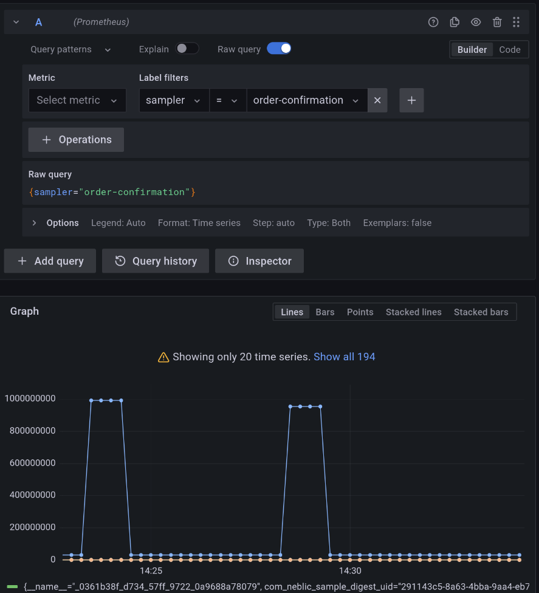

# Store and visualize metrics with Prometheus

[Prometheus](https://prometheus.io), quoting their website, *is an open-source systems monitoring and alerting toolkit* with good support to ingest OTLP metrics.

It is the primary open-source option for storing *Data Telemetry* *Metrics* due to its ease of deployment and maintenance. In also integrates perfectly with [Grafana](https://grafana.com/grafana/), making it easy and efficient to explore data samples.

## Store

### Use Neblic collector (recommended)

The Neblic collector already provides all the required changes to be able to send data to *Prometheus*. The only missing thing is to provide the collector with the *Prometheus* endpoint. That can be done populating the `NEBLIC_DATA_PLANE_EXPORTER_PROMETHEUS_ENDPOINT` environment variable with the desired value.

### Using your own OpenTelemetry collector (advanced)

!!! warning
    This approach assumes the knowledge on how to build and configure an OpenTelemetry collector.

When using your own OpenTelemetry collector, the following things have to be configured to export data to *Prometheus*:

Add the [Prometheus exporter](https://github.com/open-telemetry/opentelemetry-collector-contrib/tree/main/exporter/prometheusexporter) to the [collector builder file](https://github.com/open-telemetry/opentelemetry-collector/tree/main/cmd/builder) if necessary. Build the custom collector.
``` yaml
processors:
  ...
--8<-- "./dist/otelcol/ocb.yaml:TransformProcessor"
  ...
exporters:
  ...
--8<-- "./dist/otelcol/ocb.yaml:PrometheusExporter"
  ...
```

After doing that, an OpenTelemetry collector with the *Prometheus* exporter logic will be available. The only remaining thing to do is to modify the [collector configuration](https://opentelemetry.io/docs/collector/configuration/#basics) to enable the exporter.

Configure Loki exporter to send data to the desired endpoint:
``` yaml
exporters:
  # ...
--8<-- "./controlplane/server/otelcolext/reference.yaml:PrometheusExporter"
  # ...
```

Elevate *Sampler* resource and name to a *Prometheus* label:
``` yaml
processors:
  # ...
--8<-- "./controlplane/server/otelcolext/reference.yaml:PrometheusProcessor"
  # ...
```

Configure a new pipeline that receives data from the *Neblic* connector, uses the `transform/propagate_prometheus_labels` processor and sends the data to *Prometheus*.
``` yaml
service:
  pipelines:
    # ...
--8<-- "./controlplane/server/otelcolext/reference.yaml:PrometheusPipeline"
    # ...
```

Run the custom collector with the new configuration

## Visualize

To explore *Data Telemetry* stored in *Prometheus*, *Grafana* is the best option. 

First, you need to add *Prometheus* as a *Data Source*, the official documentation provides a [guide](https://grafana.com/docs/grafana/latest/datasources/prometheus/).

Then, you can use the *Explore* tab to perform queries and explore your *Data Telemetry*. You will need to:

* Select *Prometheus* on the top-level dropdown to explore its contents.
* Apply a *label filter* selecting one or more labels to filter what the *Data Telemetry* you want to explore.


