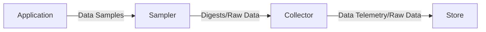
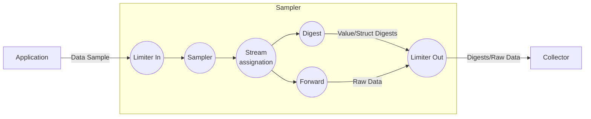
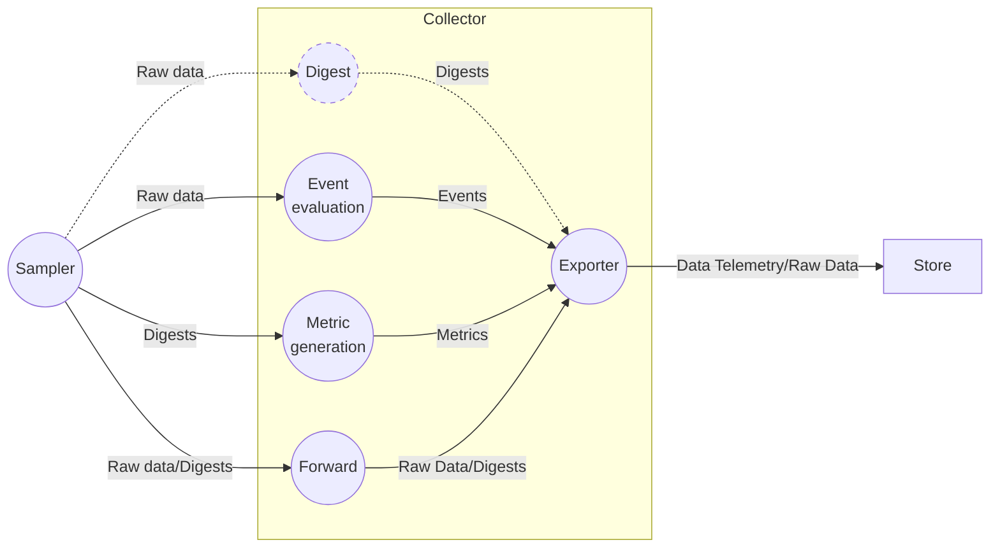

# Data collection

The data collection and analysis pipeline is divided between two components: the *Sampler* and the *Collector*. The diagram below provides a high level view of how the *Data Samples* are transformed and forwarded across the pipeline:

## Sampler

The diagram below illustrates the opreations carried out within a *Sampler*:

All the operations are configurable and can be dynamically enabled or disabled as needed:

* Limiter In: Limits how many *Data Samples* per second can be processed applying token bucket rate limiting. 
    * This limiter will randomly discard *Data Samples* but makes it very easy to set a fixed upper limit.
* Sampler: Performs deterministic sampling based on the *Data Sample* key.
    * The deterministic sampling will select a random subset of keys to process while discarding the others. It may be trickierto adjust since it is configured by specifying a percentage of the total *Data Samples* instead of using a fixed upper limit.
    * The advantage is that different *Samplers* will sample the same subset of *Data Samples* as long as they have the same deterministic sampling configuration.
* Stream assignation: Determines to which stream the *Data Sample* belongs to.
* Digest: Analyze the *Data Sample* and builds *Value Digests* and/or *Struct Digests* per each *Stream*.
* Forward: The *Sampler* can also forward the *Data Sample* raw content to the *Collector* for further analysis, storage, or *Event* detection.
* Limiter Out: Limits how many *Data Samples* and *Digests* per second can be forwarded downstream applying token bucket rate limiting.
    * This limiter will randomly discard *Data Samples* but makes it very easy to set a fixed upper limit.

!!! info
    Digests can also be generated in the *Collector* which may be a better option in certain use cases:
    
    * The *Collector* receives data from all the *Sampler* replicas (if you have multiple replicas of an instrumented service, you will have multiple identical *Samplers*) so it can generate *Digests* that aggregate all their data together.
    * Generating the *Digest* has a computational overhead that you may want to completely avoid if your application has limited resources. 
      Note that altough the application won't be impacted by the computational overhead, forwarding the *Data Sample* to the *Collector* will
      increase its network usage.

## Collector

The *Collector* is the central point that receives data from all *Samplers*. Its main function is to evaluate rules on *Raw Data* to detect *Events* and generate *Metrics* from *Digests*. It can also forward *Raw Data* and *Digests* to an external store.

* Digest: Analyzes the *Raw Data* and builds *Value Digests* and/or *Struct Digests*. *Digests* are usually built in the *Sampler* itself, but can also be configured to be built in the *Collector*.
* Event evaluation: Evaluates rules on the received *Raw Data* and generates an *Event* if it matches.
* Metric generation: Converts the digests statisticcs into OpenTelemetry metrics.
* Forward: Forwards *Raw Data* and *Digests* as-is to an external Store.

## Future planned work

### Filter raw data

To generate events, the current method requires sending the entire *Data Sample* in its raw form to the *Collector*. The *Collector* will then evaluate the configured event rules on the *Data Sample*.

However, it's often more efficient to send only the necessary data needed to assess the event rules. For more information and updates on this feature, please refer to [this](https://github.com/orgs/neblic/projects/3/views/1?pane=issue&itemId=53479138) project item.
