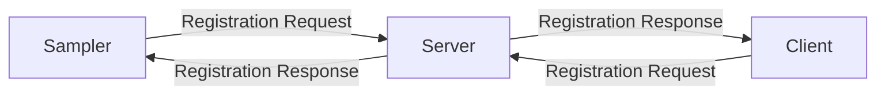

# Control Plane Protocol

The `Control Plane` protocol is implemented on top of [gRPC](https://grpc.io/). `Samplers` and `Clients` establish [bidirectional streaming RPCs](https://grpc.io/docs/what-is-grpc/core-concepts/#bidirectional-streaming-rpc) connections with the `Server`.

There are three types of messages:

* Requests: Can be sent at any time by any party. The sender waits for a response.
    * Registration or configuration requests.
* Responses: Messages generated as replies to requests.
* Messages: Can be sent at any time by any party. The receiver does not reply with a response.
    * Stats updates or error notifications.

Each Sampler and Client has an exclusive bidirectional stream, and within that stream, requests are processed sequentially. This means that responses are sent following the order in which requests were received. Messages can be interleaved within requests and responses.

In [appendix A](#appendix-a-protobuf-definitions), you can find the Protobuf definitions used by the protocol implementation.

## Registration



After establishing a connection with the server, they start the registration process which consists of:

1. `Samplers` and `Clients` send a registration request containing an id that identifies the current session.
2. `Server` replies with a registration response acknowledging their registration.

The registration request is the first message that the server expects after a new connection is established. Other messages are ignored until the registration process completes.

### Inital configuration

During the registration, the `Sampler` sends the server its initial configuration, if any. Then, the server may decide to use it if there isn't any other configuration defined, in that case, it is sent back to the `Sampler` confirming that it should configure itself using its initial configuration.


## Reconnections

The connection initiator automatically attempts to reestablish the connection creating a new stream if it is terminated for any reason, including network disconnects and any type of unhandled error. The registration process will need to start again. 

Given that the registration request includes a session id, the `Server` is capable of resuming the session. For example, it may determine that there is no need to send the configuration to the `Sampler` again after a reconnection.

## Requests

### Sampler -> Server

* Registration

### Server -> Sampler

* Configuration

### Client -> Server

* Registration
* List samplers
* Sampler configuration

## Messages

### Sampler -> Server

* Stats update

### Server -> Client

* Sampler stats update

## Appendix A: Protobuf definitions

``` protobuf
--8<-- "./protos/controlplane.proto"
```
