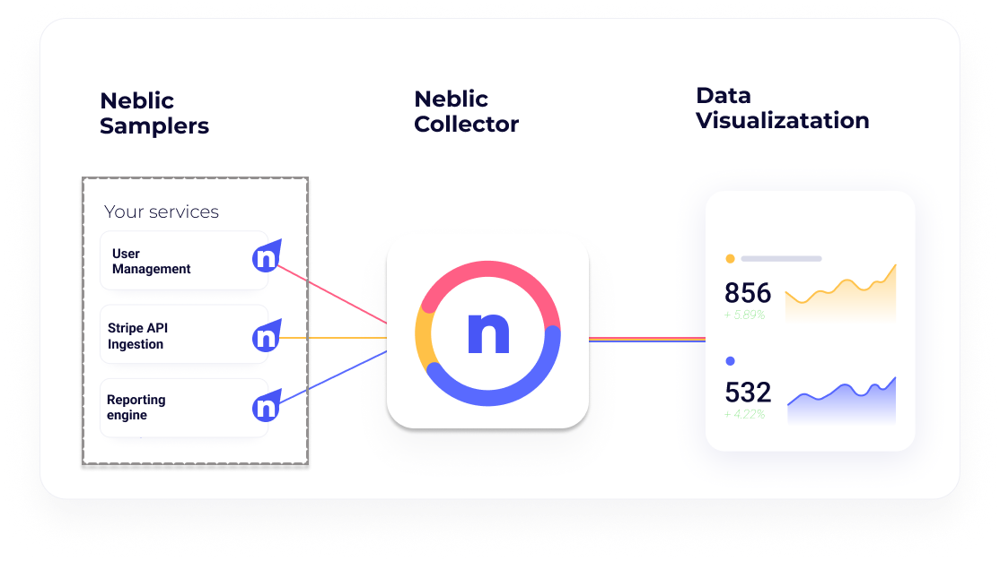

# How does Neblic Work?

The Neblic platform enables you to observe your application data and get actionable insights by using three main components:

* Samplers, which are deployed across points of interest in your application where you want to get application data that is then sent to the collector.
* Collector  which receives data samples from all the Samplers and processes them before sending them to the Visualization engine.
* Visualization engine is where all the samples are processed, and data is available for visualization and analysis.

Samplers -as their name implies- sample data from the application in the points you’ve deployed them. By application data we mean the exact data contained in the events, transactions, requests and responses that the application is processing at each point.

All those samples are sent to the collector which is the central point from which samples will then be forwarded to the visualization engine. However, the collector also has another key role, it’s the central point for coordinating the configuration for all the samplers.

Lastly, after data is sampled and sent through the collector, you’ll want to store and visualize the data. As of this time, we recommend you use Loki and Grafana, however you can use other tools if you’re more comfortable with them.

We are actively working on dedicated analysis and visualization tools for this kind of data, do reach out to us if you have some thoughts on what you’d like to achieve.