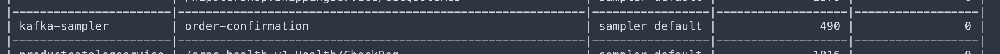

# Playground

## How to locally try Neblic using Docker Compose

The best way to get a feel of how Neblic can help you troubleshoot your distributed applications is to locally spin up a few services instrumented with Neblic, and play with them. We provide a playground based on Google's awesome [`microservices-demo`](https://github.com/GoogleCloudPlatform/microservices-demo) project that, with just a few commands, will allow you to troubleshoot a microservices-based e-commerce application using Neblic.

!!! note
    This guide assumes that the reader has a basic understanding of Docker Compose. If not, please, refer to the official [`Docker Compose`](https://docs.docker.com/compose/) documentation to understand what it is and how to install it. 

    The goal of this guide is not to explain how Neblic or its components work, but to demonstrate its capabilities by troubleshooting a demo application. Therefore, it won't go into detail about every concept or component introduced.

### Bringing up the environment

1. Clone the [`Neblic playground`](https://github.com/neblic/playground) repository
    ``` shell
    git clone https://github.com/neblic/playground
    cd playground
    ```

2. Use Docker Compose to spin up the demo services and Neblic components. The first time will take a while (should be less than 5 minutes on a modern machine) as it needs to pull and build some containers.

    ``` shell
    DOCKER_BUILDKIT=1 docker compose up -d
    ```
    This command will bring up the services described [here](https://github.com/neblic/playground/tree/main/svc#architecture) plus a few Neblic components.

3. You can load the e-commerce site by going to [http://localhost:8080/](http://localhost:8080/). You can freely interact with it. There is also a load generator that mimics user behavior which is constantly adding items to the cart and creating orders.

### Troubleshooting a bug

Now, let's troubleshoot a simple bug with Neblic! Someone reported that the order confirmation emails sent by the email service are missing the customer's name. You can verify this by going to [http://localhost:8081](http://localhost:8081). This simple web server shows the confirmation emails that would have been sent.


As you can see in the architecture diagram, the `email` service (bottom-left corner) receives order confirmation messages from `Apache Kafka`. These are generated by the `checkout` service. To troubleshoot the issue, the first step might be to look at what the `email` service is reading from `Kafka` to make sure it is getting the data we expect. To do this, you can enable a `Sampler` that gets  `Data Samples` from `Kafka` and have it export them so that you can see the messages received on that topic.

1. To configure the sampler, you will use the `neblictl` command. You can use the `neblictl` binary bundled in the collector `otelcol` image. Run the following command from the `playground` folder.

    ```shell
    docker compose exec -it otelcol neblictl
    ```
    `neblictl` is an interactive command-line interface (CLI), so executing it will show you a prompt where you can enter commands.

2. The `email` service consumes order confirmation messages from the topic called `order-confirmation`. Let's find the `Sampler` that intercepts them. The following `neblictl` command will get all the registered `Samplers`.

    ```
    >>> list samplers
    ```
    
    You should see a table listing many `Samplers` and among them, one called `order-confirmation`. This `Sampler` is automatically created by a service called `kafka-sampler` that is capable of getting data on-demand from any `Kafka` topic. 

3. The last column (`Samples exported`) shows the number of samples that have been exported. Given that there aren't any `Sampling Rules` defined, right now the value is `0`. To keep it simple, you can just add a rule that gets all the `Data Samples` that the `Sampler` intercepts. 

    !!! note 
        Normally, you would add a rule using an expression that will allow you to just export the `Data Samples` that meet certain conditions based on their contents (e.g. all the `Data Samples` that do not have the customer name set, `sample.order.shipping_address.full_name == ""`)

    The following `neblictl` command will create the `Sampling Rule`.
    ```
    >>> create rule kafkasampler order-confirmation true
    ```
    Less than a minute after adding the rule, you should see how the `Samples Exported` counter starts to increase.

4. To continue, you need to go to [`Grafana`](https://grafana.com/grafana/) to see `Data Samples` that have been exported to understand if the `email` service is receiving what is expected. `Grafana` is listening at [http://localhost:3000/](http://localhost:3000/) (default user: admin, password: admin). The `Data Samples` are stored in [`Loki`](https://grafana.com/oss/loki/), a database created by `Grafana labs`, that is perfectly integrated with `Grafana`. On the left menu, you will see a compass that will bring you to the `Explore` section. In there, you will need to:
    * Select `Loki` on the top-level dropdown to explore its contents.
    * Apply a `label filter` selecting the `sampler_name` called `order-confirmation` to only see `Data Samples` sent by the `Sampler` we are interested in.
    * Optionally, add a `json` filter so it parses the contents of the `Data Samples`.

    It should look similar to this:
    

    Now, after pressing `Run Query` (top right), you should see the captured `Data Samples`:
    
    Oh, it seems that it is not receiving the customer name! of course the service can't write it into the email. Then, the problem may be in another service. Let's check if the previous service, `checkout`, receives it.

6. Following the previous two steps again, you can set up another `Sampling Rule` in the `Sampler` called `/hipstershop.CheckoutService/PlaceOrderReq`. This `Sampler` is created by a gRPC interceptor that automatically creates `Samplers` in each gRPC method. 
    
    This time, to not capture all the `Data Samples` but just the ones that do not have the customer name, you could use a rule like this one (you would need to know the message schema by, for example, checking the [Protocol Buffer definition](https://github.com/neblic/playground/blob/main/svc/pb/demo.proto) or using some previously captured `Data Samples` as reference):
    ```
    >>> create rule checkoutservice /hipstershop.CheckoutService/PlaceOrderReq sample.address.full_name==""
    ```

    In `Grafana` you'll find the following `Data Sample`:
    
    Mh, no customer name either? Is the `frontend` receiving it, then?

7. A quick look at the browser's POST request sent to the `frontend` service shows that it is receiving the customer's name so apparently, we will have to dig into the `frontend` service code to understand why it is not being propagated to the `checkout` service.

    Found it! it looks like the backend team did not implement the changes to fill the customer name when processing an order, luckily, that will be an easy fix!

### Summary

This quick start has shown how you can quickly troubleshoot an issue by getting `Data Samples` from multiple services and applications using a single tool. The alternative would have been much more time-consuming as it would have involved manually consuming and filtering data from `Apache Kafka` and somehow getting the request bodies across services.

For the sake of brevity, this guide has only shown the basic functionality that Neblic can offer, but it can do much more!

### Next steps

If you would like to learn more about the concepts that define Neblic, it is recommended that you take a look at the [concepts](../getting-started/concepts.md) page. Then, once you are familiarized with how Neblic works and its architecture, you can go to the [usage](../getting-started/usage.md) guide to learn how best to deploy it in your environment!
